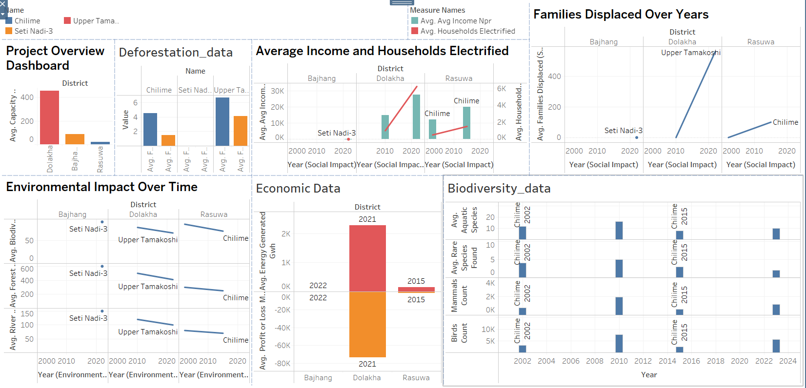

# Hydropower Project Impact Analysis (Nepal)

This project analyzes the environmental, social, economic, and biodiversity impacts of hydropower projects in Nepal using **Excel** and **Tableau Public**.

## 🔍 Datasets Used

- **Project Info**: Project name, district, river, capacity, operational timeline  
- **Environmental Data**: Forest cover, river flow, biodiversity index  
- **Social Impact**: Families displaced, electrification, income, disaster reports  
- **Economic Data**: Energy output, revenue, cost  
- **Biodiversity Data**: Mammals, birds, aquatic species, rare species found  
- **Deforestation Data**: Forest loss (sq. km and %), affected areas, timeline  

## 📊 Visualizations Created

- Project Overview  
- Environmental Impact Over Time  
- Social Impact Analysis  
- Economic Trends  
- Biodiversity Changes  
- Deforestation Trends  

## 📁 Data File

## 🖼️ Screenshot

## 🗂️ Download Data

You can download the Excel dataset used in this project here:  
[hydropower_project_analysis.xlsx](hydropower_project_analysis.xlsx)

## 📈 Tableau Dashboard

View the full interactive dashboard on **Tableau Public**:  
👉 [Click here to view the dashboard](https://public.tableau.com/app/profile/biplaw.tiwari/viz/Hydropower_analysis/Dashboard1?publish=yes)  

## 🗂️ Source of Data

The data used in this project is manually compiled and simulated for educational and demonstration purposes.  
It is based on realistic assumptions inspired by:

- Department of Electricity Development (DoED) Nepal  
- Ministry of Forests and Environment, Nepal  
- Reports on hydropower environmental assessments  
- Research publications on biodiversity and deforestation impact  
- Open-source development data for Nepal  

*Note: No direct sensitive or official data is used. All figures are fictional and created for learning.*

## 📄 License & Usage Disclaimer

This project is shared under the **MIT License** for educational and portfolio purposes.  
You are free to fork, adapt, and use the content with proper attribution.

However:

- Do not use this dataset or visualizations for real-world policy decisions.  
- This project does not represent any official stance or institutional data.  
- Attribution to **Biplaw Tiwari** is appreciated when reusing or referencing any part of this project.

---

## 🧑 Author

**Biplaw Tiwari**  
📧 tiwaribiplaw@gmail.com  
🔗 [github.com/Biplaw21](https://github.com/Biplaw21)
